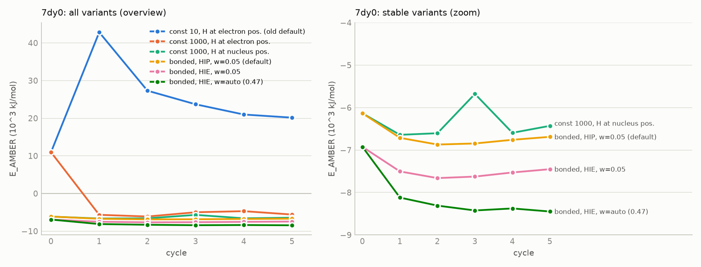
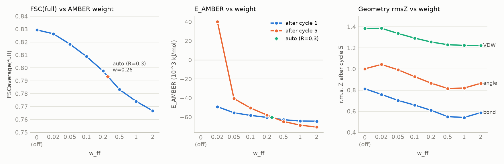
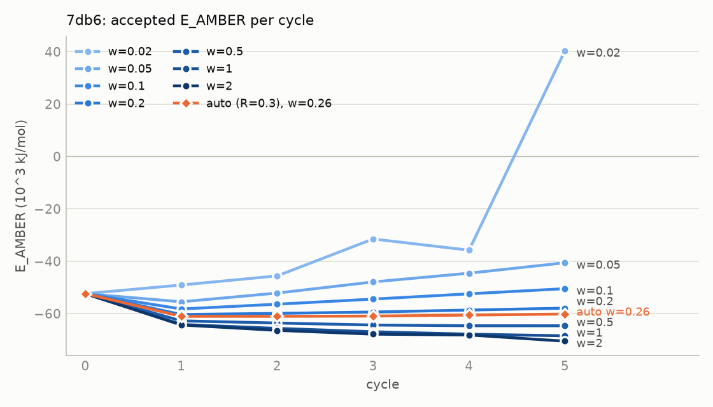
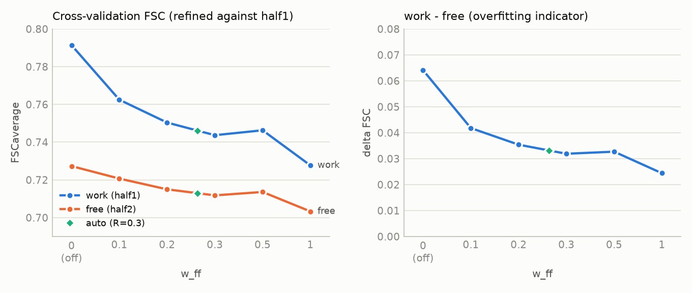

# AMBER prior の重み・Hessian 検討ノート (7db6 / 7dy0)

このノートは、AMBER 力場項を実験項と併用するときの「効き方」を決める 3 つの要素、
(1) 対角 Hessian の近似、(2) 水素の初期位置、(3) 重み $w_{ff}$ について行った検討を、
図とともにまとめたものです。個々の修正の導出は `amber_hessian_protonation_note_ja.md`、
実行手順は `build_uv_memo_ja.md` と `examples/` を参照してください。

図は `docs/dev/examples/plot_amber_weight_study.py` が `work/` の実行結果から生成します
(数値は `figures/amber_weight_study_data.json` にも書き出されます)。

```bash
cd "$PROJECT_ROOT"
.venv-openff/bin/python docs/dev/examples/plot_amber_weight_study.py work docs/dev/figures
```

## 1. 問題設定

目的関数は

$$
F = w_{exp} L_{exp} + L_{geom} + w_{ff} E_{AMBER}
$$

で、$E_{AMBER}$ は kJ/mol、$L_{geom}$ は無次元 ($Z^2$ 型) なので $w_{ff}$ は次元の異なる量を混ぜる係数である。
Gauss-Newton のステップは

$$
\Delta x = -\left( H_{geom} + w_{exp} H_{exp} + w_{ff} D_{ff} \right)^{-1}
          \left( g_{geom} + w_{exp} g_{exp} + w_{ff} g_{ff} \right)
$$

なので、力場項の効きは「勾配 $w_{ff} g_{ff}$ の大きさ」と「Hessian 近似 $D_{ff}$ の妥当性」の両方で決まる。
以下ではこの 2 つを分けて検討した。

評価指標:

- $E_{AMBER}$ の受理値の推移 (サイクルごと)。力場的に改善しているか、押し負けているか。
- FSCaverage(full): 全マップに対する当てはまり。ノイズへの過学習も含む。
- クロスバリデーション: half1 で精密化して half2 で評価した FSC (free) と、work − free の差 (過学習の目安)。
- 幾何拘束の r.m.s. Z (結合長・結合角・VDW)。力場が幾何をどれだけ引き締めるか。

## 2. 対角 Hessian と水素位置 (7dy0, apo streptavidin, 3.1 Å)



*図 1. 7dy0 における $E_{AMBER}$ の推移。左: 全条件、右: 安定した条件の拡大 (右図では $+10^4$ kJ/mol から始まる
「const 1000, H 電子位置」は省いている)。旧既定 (const 10) は 1 サイクル目で $+4 \times 10^4$ kJ/mol へ跳ね、
5 サイクル後も正のまま。*

観察:

- **const 10 (旧既定)**: 対角 Hessian $w_{ff} D_{ff} = 0.05 \times 10 = 0.5$ kJ/mol/Ų は真の曲率
  (水素で約 1,300、重原子で約 5,000 kJ/mol/Ų) の 1/100 以下。幾何拘束に曲率が無い水の回転モードで
  Newton ステップが発散し、水の水素が O から最大 2.8 Å 飛んで結合項が +27,646 kJ/mol 増えた。
- **const 1000**: 発散は止まるが、5 サイクルの $E_{AMBER}$ は −5,000〜−6,600 の間で上下する (右図の緑)。
  全原子に同じ値を与えるため、水素と重原子の曲率差 (約 4 倍) を反映できない。
- **水素の初期位置**: AMBER 有効時の `ReAdd` で核位置調整が抜けていたため、初期 $E_{AMBER}$ が +10,972 (電子位置) と
  −6,135 (核位置) で 17,000 kJ/mol 違う。初期 geom_x も 51,884 対 4,704。調整後は 1 サイクル目から力場的に妥当な位置から始まる。
- **bonded (現既定)**: 結合・結合角から原子ごとに Gauss-Newton 対角を組む。$E_{AMBER}$ は単調に近い減少で、
  const 1000 より 200〜800 kJ/mol 低い。HIE 化でさらに約 800 kJ/mol 下がる (His の +1 電荷 2 個分の静電歪みが消える)。
- **自動重み (w = 0.47)**: 7dy0 では手動の 0.05 より大きな重みが選ばれ、$E_{AMBER}$ は最も低く単調減少。FSC(full) は
  0.9524 → 0.9475 と 0.005 下がる。

結論: Hessian 近似と水素位置を直してから重みを議論する必要がある。これらが壊れた状態で重みを動かしても、
$E_{AMBER}$ の増加は重み不足ではなくステップの発散が原因で、重みでは直らない。

## 3. 重み走査 (7db6, MT1–Gi1 + ラメルテオン, 3.3 Å)

Hessian と水素位置を修正した状態で、$w_{ff}$ を 0.02〜2.0 まで走査した (5 サイクル、`--amber_his_state HIE`、
リガンド JEV は openff-2.2.1 + NAGL 電荷)。



*図 2. 重みに対する FSC(full) (左)、$E_{AMBER}$ の 1 サイクル後と 5 サイクル後 (中)、5 サイクル後の幾何 r.m.s. Z (右)。
横軸は等間隔の順序尺度 (0 は AMBER なし)。菱形は自動重み (R = 0.3、w = 0.26)。*



*図 3. 重みごとの $E_{AMBER}$ 受理値の推移。青の濃さが重みの大きさ、橙が自動重み。*

観察:

- **FSC(full) は重みに対して単調減少** (0.829 → 0.767)。力場が幾何を引き締める分だけマップへの追従が弱まる。
  ただし FSC(full) の低下は過学習の抑制も含むので、これだけでは良し悪しを判断できない (4 節)。
- **$E_{AMBER}$ の推移に転換点がある**。w ≤ 0.1 では 1 サイクル目に下がった後、毎サイクル上昇する
  (0.1 で約 +2,000 kJ/mol/サイクル)。0.02 では 5 サイクル目に +40,000 まで跳ねる: 実験項に押し負けた原子が
  力場的に不利な配置に押し込まれ、そこで結合・非結合項が発散した。w = 0.2 でほぼ横ばい、0.3 以上で減少に転じる。
- **幾何 r.m.s. Z は 0.5〜1.0 で最小** (結合 0.54、結合角 0.82、VDW 1.22)。2.0 では結合・結合角が再び悪化する。
  AMBER の平衡値と monomer library の理想値は完全には一致しないので、力場が強すぎると拘束から見た幾何は悪くなる。
- w = 0.02 では VDW rmsZ が AMBER なしより悪い (1.386 対 1.383)。弱い力場項は原子を中途半端に動かすだけで、
  クラッシュの解消には寄与しない。

## 4. クロスバリデーション (7db6)



*図 4. half1 で精密化したときの FSC(half1) (work) と FSC(half2) (free) (左)、その差 (右)。菱形は自動重み。*

観察:

- **free FSC は w = 0 が最大 (0.727)** で、重みとともに緩やかに下がる (0.2 で 0.715、0.3 で 0.712、1.0 で 0.703)。
  この系・分解能では、力場項が free FSC を改善する重みは見つからなかった。
- **work − free の差は重みとともに縮む** (0.064 → 0.024)。力場項は過学習を抑えている。
  ただし free 自体も下がるので、「過学習を減らした分がモデル精度の向上に回っている」とは言えない。
  力場が 3.3 Å の実験情報と競合して、マップが支持する変位まで戻している可能性がある。
- w = 0.5 で work/free がわずかに戻る (0.746/0.714) が、走査の刻みと 5 サイクルという短さを考えると、
  0.3〜0.5 の差は有意とは言えない。

## 5. 勾配ノルム比による自動重み

$$
w_{ff} = R \, \frac{\lVert g_{geom} \rVert_{xyz}}{\lVert g_{ff} \rVert_{xyz}}
$$

を 1 サイクル目に評価して固定する (`--amber_weight_auto R`)。基準を幾何拘束項にした理由と導出は
`amber_hessian_protonation_note_ja.md` 7 節。

| 系 | $\lVert g_{geom} \rVert$ | $\lVert w_{exp} g_{exp} \rVert$ | $\lVert g_{ff} \rVert$ | $\lVert g_{ff} \rVert / \lVert g_{geom} \rVert$ | $w_{ff}$ (R = 0.3) |
|---|---:|---:|---:|---:|---:|
| 7db6 | 1.03 × 10⁴ | 4.9 × 10³ | 1.19 × 10⁴ | 1.16 | 0.259 |
| 7dy0 | 6.5 × 10³ | 1.9 × 10³ | 4.1 × 10³ | 0.64 | 0.471 |

- 7db6 では走査の転換点 (0.2〜0.3) に入り、$E_{AMBER}$ は 5 サイクルで −61,048 → −60,161 とほぼ横ばい (図 3 の橙)。
  free FSC 0.713 は w = 0.3 の固定値 (0.712) と同等。
- 7dy0 では力場勾配が幾何勾配に対して相対的に小さいため、大きな重みが選ばれる。系ごとに異なる
  「力場勾配の相対的な大きさ」を吸収するのが自動化の狙いで、その意味では期待通りに動いている。
- R = 0.3 は 7db6 の走査で校正した値である。R を 1.0 にすると 7db6 で w = 0.86 となり、図 2 で FSC(full) が
  0.78 を下回る領域に入る。他系・他分解能で R の妥当性を確認する必要がある。

## 6. 議論

1. **重みより先に Hessian**。2 節のとおり、対角 Hessian が小さすぎる状態では重みを上げても下げても
   $E_{AMBER}$ は発散する。結合項からの原子別対角推定 (真値の 1〜4% 以内) に替えて初めて、重みの議論が意味を持つ。

2. **$E_{AMBER}$ の推移は重みの下限を、FSC は上限を与える**。$E_{AMBER}$ が毎サイクル上昇する重みは
   「力場項が仕事をしていない」状態で、これが下限 (7db6 で 0.2 付近)。FSC(full) と free FSC の低下が
   受け入れられなくなる重みが上限 (7db6 で 0.5 付近)。自動重み R = 0.3 はこの窓の下端寄りにある。

3. **free FSC は改善しない**。3.3 Å の 7db6 では、力場項は過学習 (work − free) を減らすが free FSC 自体は
   単調に下がる。力場が効くのは「マップが決めきれない自由度」(水素、側鎖末端、水の向き) であり、
   FSC の主要部分を担う主鎖・大きな側鎖はマップが決めている。free FSC で力場項の価値を測るのは分解能が
   もっと低い系 (4 Å 以下) やリガンド周辺に限った局所指標のほうが適切で、これは今後の課題。

4. **幾何指標の U 字**。r.m.s. Z は 0.5〜1.0 で最小になる。AMBER と monomer library の平衡値のずれが
   強い重みで顕在化するためで、力場項を「拘束の代替」ではなく「拘束の補助」と位置付ける根拠になる。

5. **サイクル数**。5 サイクルでは $E_{AMBER}$ の傾きは見えるが収束はしていない。w = 0.1 の上昇傾向が
   どこで止まるか、w = 0.3 以上が平衡に達するかは 20 サイクル程度の実験が必要。

6. **系依存性**。7dy0 と 7db6 で $\lVert g_{ff} \rVert / \lVert g_{geom} \rVert$ が 2 倍違う。水素の割合、
   水の数、荷電残基の数、リガンドの有無が影響する。自動重みはこれを吸収するが、R の校正が 1 系だけなので、
   低分解能 (5is0, 3.4 Å) や高分解能 (6cvm, 1.9 Å) で同じ手順を繰り返して R の範囲を確かめたい。

## 7. 最適化器の 2 バージョン

6 節の 1 で述べたように、対角のみの力場 Hessian は減衰として働いている。これを分離するために 2 つの版を実装した。

### 7.1 実装

| 版 | オプション | 内容 |
|---|---|---|
| 非対角 Hessian + 従来の Gauss-Newton | `--amber_hessian_offdiag` | 結合・結合角の Gauss-Newton ブロックを非対角ごと行列に入れる。`AmberFFPrior.hessian_matrix()` |
| 対角のまま L-BFGS | `--amber_minimizer lbfgs` | 対角を前処理に使い、残りの曲率を勾配履歴から作る。`Refine.run_cycle_lbfgs()` |

補足:

- 完全な BFGS は使えない。密な逆 Hessian は $n_{params}^2$ で、7db6 (46,000 パラメータ) では 17 GB になる。
  記憶制限付きの L-BFGS-B (`maxcor=10`) を使う。
- L-BFGS は $y = \sqrt{\mathrm{diag}(A)}\, x$ という対角前処理座標で走る。CG ソルバと同じ前処理で、
  モデル Hessian の対角が 1 になる。信頼領域は `scale_shifts()` と同じ (xyz ±1 Å、B ±30、occ/dfrac ±0.5) で、
  L-BFGS-B の箱制約として渡す。
- 非対角版はステップが約 6 倍長くなるため、直線探索の半分割回数を 3 から 8 に増やした
  (`--amber_ls_trials`、非対角時の既定 8)。3 回のままでは 7dy0・7db6 とも「function not minimised」が出た。
- `hessian_matrix()` の検証: 対称性 9e-13、対角は `hessian_diag_vector()` と一致、フロアを 0 にすると
  剛体並進が零モードになる (t'At = 2.6e-10)。素朴なループ実装との一致も確認済み (`test_hessian_matrix_offdiag`)。

### 7.2 結果 (5 サイクル、R = 0.3 の自動重み、HIE、CPU プラットフォーム)

7dy0 (apo streptavidin, 3.1 Å, w_ff = 0.471):

| 版 | E_AMBER 最終 | 結合 rmsZ | 結合角 rmsZ | VDW rmsZ | FSC(full) | 実行時間 |
|---|---:|---:|---:|---:|---:|---:|
| GN + 対角 (現行) | −8,448 | 0.569 | 0.864 | 1.183 | 0.9475 | 18 s |
| GN + 非対角 | −9,106 | 0.604 | 0.852 | 1.134 | 0.9500 | 20 s |
| L-BFGS + 対角 | −9,342 | 0.594 | 0.865 | 1.107 | 0.9493 | 377 s |

7db6 (MT1–Gi1 + ラメルテオン, 3.3 Å, w_ff = 0.259):

| 版 | E_AMBER 最終 | 結合 rmsZ | 結合角 rmsZ | VDW rmsZ | FSC(full) | 実行時間 |
|---|---:|---:|---:|---:|---:|---:|
| GN + 対角 (現行) | −60,161 | 0.590 | 0.847 | 1.246 | 0.7933 | 63 s |
| GN + 非対角 | −56,244 | 1.217 | 0.895 | 1.240 | 0.8032 | 89 s |
| L-BFGS + 対角 | −51,618 | 0.684 | 1.051 | 1.323 | 0.8275 | 648 s |

サイクルごとの結合 rmsZ:

| 版 | 7dy0 | 7db6 |
|---|---|---|
| GN + 対角 | 1.47 → 0.62 → 0.57 → 0.57 → 0.57 → 0.57 | 0.74 → 0.48 → 0.53 → 0.55 → 0.58 → 0.59 |
| GN + 非対角 | 1.47 → 1.35 → 1.28 → 0.84 → 0.60 → 0.60 | 0.74 → 1.27 → 1.49 → 1.60 → 1.30 → 1.22 |
| L-BFGS + 対角 | 1.47 → 0.53 → 0.60 → 0.60 → 0.60 → 0.59 | 0.74 → 0.55 → 0.60 → 0.67 → 0.66 → 0.68 |

### 7.3 議論

1. **減衰が消えた効果は予想どおり現れる**。非対角版は最初の数サイクルで結合 rmsZ が跳ね上がる
   (7db6 で 1.60 まで)。総目的関数は毎サイクル減っているので直線探索は受理するが、幾何は悪化する。
   非対角を入れた行列は剛体モードに曲率を持たないため、そのモードの曲率は幾何項とデータ項とフロアだけで
   決まり、Gauss-Newton の線形化がその方向で過大なステップを出す。対角近似はこれを偶然抑えていた。
   7db6 では自動重み調整が働いて w_exp が 1.105 から 0.913 に下がった。
2. **FSC は両版とも改善する**。7dy0 で 0.9475 → 0.9500 (非対角) / 0.9493 (L-BFGS)、
   7db6 で 0.7933 → 0.8032 / 0.8275。より深く最小化できている。
3. **L-BFGS は安定だが遅い**。7dy0 では 18 s → 377 s (21 倍)、7db6 では 63 s → 648 s (10 倍)。
   1 反復ごとに Fc の再計算と Fisher 対角の構築が入るためで、勾配評価が支配的。
   7dy0 では 3 サイクル目以降 nit が 2 まで落ちて収束したが、7db6 では毎サイクル maxiter = 20 に達しており未収束。
4. **目的関数値 f はラン間で比較できない**。サイクルごとに `update_ml_params()` が D と S を再推定するため、
   f の絶対値は最尤パラメータに依存する。ラン間の比較は FSC、E_AMBER、幾何 rmsZ で行うべき。
5. **重みは最適化器と一体で調整する必要がある**。7db6 の L-BFGS は FSC が最も高い一方で E_AMBER と幾何が
   現行版より悪い。より深く最小化できる最適化器では、同じ w_exp・w_ff がデータ寄りに効きすぎる。
   5 節の R = 0.3 は Gauss-Newton の未収束な挙動に対して校正した値なので、最適化器を変えたら走査をやり直す必要がある。

### 7.4 Hessian の正定値性

非対角を入れると行列が特異に近づくので、正定値性を構成の段階で保証してある。
導出・実装・数値検証は `amber_hessian_protonation_note_ja.md` 8 節。

**構成上の保証**: 結合・結合角はどちらも $E = \frac{k}{2} q(x)^2$ の形なので、Gauss-Newton 近似では
$k\,(\nabla q)(\nabla q)^{\top}$ という外積の和になり、$k \ge 0$ なら半正定値。したがって

- `_extract_bonded_terms()` で $k \le 0$ の項を落とす (警告を出す)。実測では 7dy0 の結合 $k$ の最小が 2,594、
  7db6 で 1,389、結合角は 273 以上で、負の力定数は現れない。
- 結合角の勾配は $1/\sin\theta$ を含むため、直線配置に近いと発散する。`MIN_SIN_ANGLE`
  ($\sin 5^\circ$) で下限を切り、発動時は警告する。実測の最小は 7dy0 で $\sin\theta = 0.715$ (45.6°)、
  7db6 で 0.719 なので現状は発動しない。ニトリルやアジド、歪んだ初期モデルでは効く。
- フロアは非負の対角しか足さないので、半正定値性を壊さない。
- 重み $w_{ff} \ge 0$ を CLI で検証する。負の重みは半正定値行列を引くことになり不定になる。
  自動重みも 0 で下限を切る。

**実測** (biotin, 124 パラメータ、データ項なし、密行列の固有値):

| 行列 | 最小固有値 | 判定 |
|---|---:|---|
| 幾何拘束のみ | −0.0000 | 半正定値 |
| 力場、対角のみ | 0.0000 | 半正定値 |
| 力場、非対角 | −0.0000 | 半正定値 |
| 幾何 + 0.3 × 力場 (対角) | −0.0000 | 半正定値 |
| 幾何 + 0.3 × 力場 (非対角) | −0.0000 | 半正定値 |
| 上 + LM リッジ 10 | 10.000 | **正定値** |
| 力場非対角、フロア 0 | −1.8e−12 | 半正定値、零モード 6 個 (並進 3 + 回転 3) |

負の固有値は現れず、すべて機械精度の範囲で半正定値。ただし**リッジを入れないと厳密な正定値にはならない**。
これは力場項の性質ではなく、幾何拘束自体が並進・回転不変で零モードを持つためで、通常はデータ項が
その曲率を補う。水素はデータ項から除外されているので、水素の自由度は拘束と力場項だけで決まる。

**明示的な減衰**: `--amber_lm_damping LAMBDA` を追加した。$\lambda I$ を正規方程式の対角に足す。
重みとは独立なので、力場の強さとステップの減衰を分離できる (6 節の 1 で指摘した交絡の解消)。
7dy0 の非対角版での効果:

| 設定 | CG 非収束回数 | E_AMBER の推移 | 結合 rmsZ の推移 | FSC(full) |
|---|---:|---|---|---:|
| 非対角、減衰なし | 1 | −6,925 → −4,286 → … → −9,106 (振動) | 1.47 → 1.35 → 1.28 → 0.84 → 0.60 | 0.9500 |
| 非対角、λ = 100 | 0 | −6,925 → −8,299 → … → −9,019 (単調) | 1.47 → 0.61 → 0.59 → 0.61 → 0.63 | 0.9466 |
| 非対角、λ = 1000 | 0 | −6,925 → −7,971 → … → −8,438 (単調) | 1.47 → 0.62 → 0.58 → 0.58 → 0.59 | 0.9435 |
| 対角 (既定) | 0 | −6,925 → −8,120 → … → −8,448 (単調) | 1.47 → 0.62 → 0.57 → 0.57 → 0.57 | 0.9475 |

λ = 100 で E_AMBER が単調減少し、初期の幾何の跳ね上がりも消える。FSC は減衰なしより 0.003 低いが対角版と同程度。
減衰なしの非対角版は 5 サイクル中 1 回、CG が発散して既存の gamma 機構 (0 → 0.0525) が働いていた。

### 7.5 現状の推奨

- 既定は変えていない (GN + 対角)。
- 非対角版を使うなら `--amber_lm_damping 100` を併用する。減衰なしでは E_AMBER が振動し、
  初期サイクルで幾何が悪化する。
- 収束の確認や小さい系では `--amber_minimizer lbfgs --amber_lbfgs_maxiter 50` が有効。大きい系では時間がかかる。

## 8. 今後の実験

- 20 サイクルでの $E_{AMBER}$ と free FSC の収束確認 (w = 0.1, 0.3, auto)。
- リガンド周辺の局所指標 (JEV 周辺 5 Å の map–model 相関、Fo–Fc のピーク) による評価。
- 5is0 (TRPV1 + capsazepine, 3.4 Å) と 6cvm (β-gal + PETG, 1.9 Å) で同じ走査を行い、R の分解能依存性を見る。
- 幾何 r.m.s. Z の U 字の原因 (AMBER と辞書の平衡値差) を結合種別に分解する。
- 非対角版と L-BFGS 版それぞれで重みの走査をやり直す (7.3 の 5)。
- λ と w_ff の二次元走査 (減衰と力場強度を分離したうえでの最適点探索)。
- L-BFGS の勾配評価コストを下げる (Fisher 対角の構築を勾配計算から切り離す)。

## 9. データと再現

| 内容 | 場所 |
|---|---|
| 重み走査 (FSC full) | `work/7db6_weight_scan/w*/` |
| 重み走査 (クロスバリデーション) | `work/7db6_weight_scan_cv/w*/` |
| 自動重み 7db6 | `work/7db6_weight_auto/{full,cv}/` |
| 自動重み 7dy0 | `work/7dy0_weight_auto/` |
| 7dy0 Hessian・水素位置の比較 | `work/7dy0_hessian_study/*/` |
| 最適化器 3 版の比較 (7dy0 / 7db6) | `work/minimizer_study/{dy0,db6}_{gn,offdiag,lbfgs}/` |
| LM 減衰の効果 (7dy0, 非対角) | `work/lm_damping_study/lm_dy0_{100,1000}/` |
| 図の数値 | `docs/dev/figures/amber_weight_study_data.json` |
| 走査スクリプト | `docs/dev/examples/scan_amber_weight_7db6.sh` |
| 作図スクリプト | `docs/dev/examples/plot_amber_weight_study.py` |
| 最適化器の比較スクリプト | `docs/dev/examples/compare_amber_minimizers.py` |
